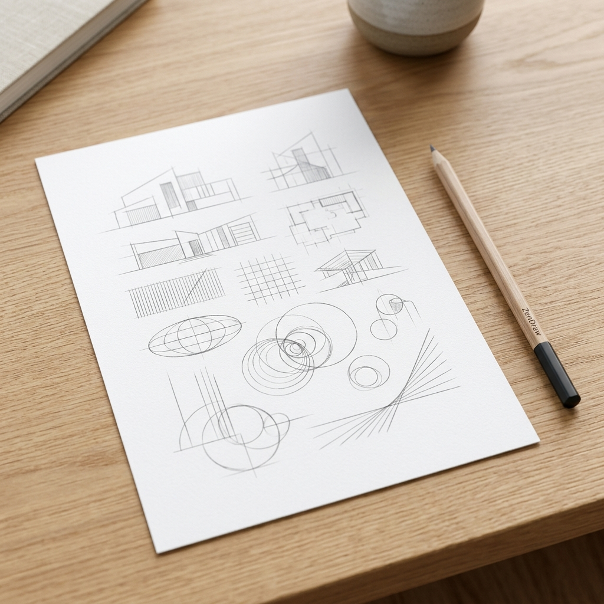

# ZenDraw | Professional Drawing Academy



**ZenDraw** is a minimalist, professional-grade linear pattern generator designed for artists to practice foundational drawing skills, build muscle memory, and improve line confidence.

Inspired by academic drawing curricula like *Drawabox*, ZenDraw provides 18 structured exercises covering everything from basic accuracy to complex 3D form intersections.

## ✨ Features

- **18 Academic Exercises**: Grouped into Lines, Flow, Perspective, and Tonal categories.
- **Minimalist "Zen" UI**: A clean, distraction-free environment that mimics a real sketchbook.
- **Muscle Memory Focus**: Includes ghosting guides, dashed lines, and precision markers.
- **Advanced Zoom View**: Scale the canvas from 50% to 300% to focus on fine details.
- **Random Exercise**: Instant one-click workout generation.
- **Export for Print**: High-resolution PNG export for physical practice.
- **Responsive Design**: Works perfectly on desktops and tablets.

## 🛠 Exercises Included

### Lines & Accuracy
- **Ghosted Lines**: Connecting two points with precision.
- **Precision Zigzags**: Sharp direction changes and joint control.
- **Accuracy Chains**: Sequential dot-to-dot flow.

### Flow & Rhythm
- **S-Curves & Flow**: Smooth shoulder-driven motion.
- **Rhythmic Meanders**: Repeating geometric patterns.
- **Flowing Ribbons**: Parallel curves on complex surfaces.

### Form & Perspective
- **Confidence Ovals**: Overlapping ellipses and circular motion.
- **Perspective Planes**: Spatial awareness and tilted volumes.
- **Surface Contours**: Visualizing 3D mass.
- **Perspective Funnels**: Circular perspective alignment.
- **Form Intersections**: Identifying shared 3D boundaries.
- **Organic Forms**: Drawing complex "sausage" shapes.
- **Cast Shadows**: Constructing 1-point and 2-point shadows.

### Tone & Texture
- **Tonal Hatching**: Parallelism and density control.
- **Pressure Tapers**: Controlling line weight and taper.
- **Density Gradients**: Smooth transitions from light to dark.
- **Texture Patches**: Micro-motor control for textures (fur, wood, etc.).
- **Negative Space**: Focusing on the shapes between objects.

## 🚀 Getting Started

1. Clone the repository:
   ```bash
   git clone <repository-url>
   ```
2. Run a local server:
   ```bash
   npx serve .
   ```
3. Open `http://localhost:3000` in your browser.

## ⌨️ Shortcuts

- **Ctrl/Cmd + Mouse Wheel**: Zoom In / Zoom Out.
- **Select All**: Quick setup for a full-page workout.
- **Lucky Dip (Random)**: Let the app decide your next challenge.

---
*Observe. Ghost. Draw.*
